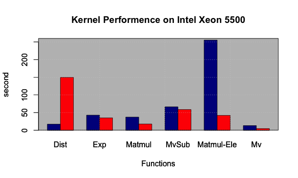

% Project Report
# Introduction
Land surface coverage data from satellite observations must be interpreted using physical models, which are computationally expansive. Using a surrogate Gaussian process (GP) emulator instead of complex physical models has been proved much more efficient. The GP emulator is written in python, which is part of a python-based Earth Observation Land Data Assimilation System (EO-LDAS). However the current performance of the GP emulator is still far away from ready to process vast data from the satellites.

The performance bottleneck of the emulator is the  _predict_ function. The objective of this project is to provide an appropriate parallel solution for this predict function based on an investigate the performance of both CPU and GPU platforms. A prototype GPU CUDA/C++ implementation of the _predict_ function has been integrated to the python emulator, which has achieved 65x speedup on K20 GPU comparing to the python CPU implementation. 

# Python predict function
## Code explanation

The emulator calculates a hyper-parameters set first and uses these hyper-parameters to calculate the approximation of the parameters, uncertainty and the associated gradient by the _predict_ function. The _predict_ function has two inputs, first is the 2D array consists of Nparam (~10) parameter vectors (Npredict), such as biophysical parameters or state variables (e.g leaf area index) by satellites, and second the inverted hyper-parameter covariance array (Ntrain x Ntrain)(~250) provided by the emulator. The length of the input vectors can reach 1e8.

The python _predict_ function is wrapped in GaussianProcess class, which has around 30 lines with six major numpy or scipy functions/operations of either matrix operations or array element wise operations. There are two features of  _predict_ that can benefit the GPU implementation, which is first, there is no branching; second, inside each parameter vector (~ 1e8), elements can be calculated independently, i.e. we can arbitrarily decide the size based on the performance tuning and the capability of GPU. We will go through this in the later sections.

## Performance analysis
Tests have been carried out on Legion with Xeon 5500 CPU. Interestingly, according to the performance table below, the most computational intensive functions are not the most time consuming ones, e.g. the matrix multiplication costs the same amount of time per call as the element wise array multiplication where the previous one has one magnitude higher the computational complexity than the later one. This inconsistency is caused by a different level of optimisation of numpy/scipy. If we take a close look at the numpy source code, its matrix multiplication function has a C extension with CBLAS. That’s the reason why the performance numpy matrix operations is almost comparable to the C++ implementation. The element wise operations take 88% of total CPU wall time. On the contrary, due to a good optimisation under numpy and less number of calling, the matrix operations take only 12%. 

| Rank  | Operation                                         | Call  | Percentage of total wall time (%)     |
|:----: |-------------------------------------------------- |:----: |:---------------------------------:    |
|   1   | Array element wise multiplication (Matmul - Ele)  |  10   |               58.01                   |
|   2   | Matrix vector subtraction (MvSub)                 |  10   |               15.08                   |
|   3   | Array update: exp (Exp)                           |   3   |                9.71                   |
|   4   | Matrix multiplication                             |   1   |                8.47                   |
|   5   | Euclidean distance (Dist)                         |   1   |                5.54                   |
|   6   | Matrix vector multiplication (Mv)                 |  10   |                3.00                   |
|       | Total                                             |       |               99.81                   |

## Comparison with C-BLAS implementation

In general, C/C++ is regarded as one of the most efficient languages on CPU platforms. Before implementing the GPU _predict_, we would like to know how much potential does a CPU has on C/C++ with reasonable amount of effort. A very primitive C++ with CBLAS implementation has been carried out for this purpose. 

All major functions except distance calculation have a performance improvement. The performance of the element wise array multiplication has a significant improvement. However what we didn’t expect is that the distance function of C++ is even slower the python scipy _cdist_.
The reason of that is maybe the bad memory access pattern obtained in the our distance function. We will just keep it in mind, and not do any further optimisation on it since this implementation is just to give us an idea about how fast can CPU achieve. The scipy distance performance can more or less represent the highest level of CPU performance with reasonable amount of effort. 

The result of the performance comparison shows the C++ predict function can be 1.3x faster than its python counterpart. If we ignore impact of distance function, C++ implementation is around 2.5x – 5x faster than original python implementation. The performance can vary from platforms, compilers and python versions. 

# GPU implementation of GP-Emulator
## CUDA/C++ implementation
CUDA with C/C++ extension is one of the most common and straightforward ways of heterogeneous programming on CUDA (NVidia) device. The CUDA APIs enable programs to control the CUDA device and memory explicitly.  

In spite that there is no standard python CUDA extension provided by NVidia, there are many third party APIs or wrappers that allow users to do heterogeneous programming in python, such as numbapro, theano, and pycuda.  They are usually easier to use, like theano, wrapped entirely the CUDA derivatives in python functions, leaving nothing for users to control the device explicitly. Some other APIs, such as Numbapro, which introduces not only wrapped functions, but also a CUDA dialect. In general, the third party APIs are easier to implement and easier to maintain but more difficult to control and their behaviour is more difficult to understand. 

Good software should find a balance between the software sustainability and the performance. However in this project we are more interested in investigating the behaviour of GPU and exploiting the all the resource of it. CUDA can give us more freedom in tuning. The prototype has been made in C++/CUDA, integrated to python emulator with C-Python API. With the CUDA implementation, we can set a performance reference of future GPU development.

## Memory issues
In the emulator, we have to at least hold two Npredict x Ntrain (~ 1e8 x 250) matrix (93G) at the same time. GPU memory (~5G) cannot cope with such a large demand. Fortunately, elements inside each parameter vector are independent to each other; in other word, we can truncate the large input vectors (Npredict) into multiple pieces and feed them slice by slice to the _predict_ function. This feature of the emulator solves the memory scarcity issue and moreover enables multiple GPUs implementation in the future. We will go through this in the later sessions. The size of input vector we feed every time to the GPU predict function is 2e5(~400M).
 
## Performance of GPU Kernels
| Rank  | Operation     | Call  | Percentage of total wall time (%)     |
|:----: |------------   |:----: |:---------------------------------:    |
|   1   | MvSub         |  10   |                21.1                   |
|   2   | Matmul-Ele    |  10   |                17.1                   |
|   3   | Dist          |   1   |                16.3                   |
|   4   | Mv            |  10   |                6.5                    |
|   5   | Matmul        |   2   |                3.8                    |
|   6   | Exp           |   1   |                0.1                    |
|       | Total         |       |               99.81                   |

To avoid GPU/CPU memory transferring overhead, the whole _predict_ has been migrated on GPU, rather than only computational intensive operations. The GPU _predict_ is formed by multiple kernels, which correspond to its CPU counterparts, i.e. six major operations.

On the one hand we made array element wise operations kernels on GPU. GPU is very good at dealing with these problems due to its embarrassingly parallel feature. Meanwhile, cuBLAS has been implemented for the matrix operation component of the _predict_. 

There are three major indicators to measure the GPU optimisation. First is occupancy (active warp/ maximum warp), which indicates if there are sufficient warp (32 threads) of GPU has been launched so that the latency may be covered; the rest two are the indicators of utilisation GPU resource including memory bandwidth (achieved bandwidth/device maximum bandwidth) and computation (flop achieved/maximum flops). 

Array element wise operations still are the most time consuming part of the _predict_. Let us examine the two most expansive kernels (MvSub & Matmul-Ele) here. These kernels are memory bound, which means the memory operations are heavier than computation, i.e. each floating-point operation needs two times memory access. The memory bandwidth of both kernels has been largely saturated, i.e. utilisation of memory bandwidth is 85% respectively, while the computation is relatively low, 20% - 35%, due to its memory bound nature. It means the computation units of GPU are not fully exploited, due to the latency. The occupancy achieved by both kernels are very high, around 75%, which means the GPU has almost tried its best to overlap the latency by launching more concurrent threads. At this point, the further optimisation can only lie upon the improvement to memory access pattern so that the access of memory can be more efficient, which requires much more effort. 

## Predict function performance 
Based on the performance benchmark on Emerald K20 GPU. GPU doesn’t introduce a very large overhead in the _predict_. Memory copy between device and host takes only 0.1% of total run time. The entire GPU wall time is only 65.8% of total wall time, which means these once very expansive kernels are no longer the major performance bottleneck anymore, instead the python part of the _predict_ (34.2%), (mainly truncating and distributing data to feed GPU) becomes the new bottleneck. To optimise this part will be the first priority of future optimisation. 

Conventionally, speedup is used as a metric to measure the performance gain of both serial and parallel optimisation. But strictly taken, one can only use it to compare the performance on the same platform. In heterogeneous programming, the speedup is just for giving an idea about the performance rather than a strict measurement, since the chose of different platform as a base of comparison can change entirely the final result. The speedup in our project will be based on the performance of Intel Xeon 5500 CPU on Legion, which is the fastest CPU platform we get in this project. 

The tests have been carried out on 3 nvidia GPU cards, M2070 on Legion (tests are not ready due to the temporary outage of legion GPU), M2090 and K20 on Emerald. K20 is a Kepler architecture GPU, which is the latest architecture of NVidia GPU, while M2070/90 is Fermi. The most distinctive difference between them is that K20 has more than 4 times thread processors than M series. _predict_ function on K20 shows 3 times faster than of M series. It takes K20 875 second to finish the _predict_ function with the vector size of 1e8. 

Since GPU is optimised on its single precision operations, the single precision _predict_ function is much faster than the double precision one. Both implementations have been applied in the source code which can be switched by the users in light of the the performance and the errors. 

## Software development details

The main objective of this project is to accelerate the GPU Gaussian Process _predict_ function, which is a very small part of the code. There is no major change of the structure. The predict function C++/CUDA extension compilation is managed by a cross platform compilation tool cmake which has also been integrated in the python setup. 

Unit tests have been introduced to the program for the purpose of verifying the correctness of GPU implementation especially by comparing the GPU results with original python results. Tests are carried out recursively with the changing the lengths input vectors under the CUnit testing framework. 

The code is compiled and tested every overnightly on RSDT continuous integration system Jenkins.

# Summary and the future work

In this project, we have investigated the performance _predict_ in the GP emulator. The most computational intensive operations, such as matrix multiplication and distance calculation are not necessary to be the most time consuming operation on CPU, due to its optimisation by scipy and numpy library. The major bottleneck of _predict_ function is the array element wise operations which can be easily implemented on GPU.  A GPU implementation prototype has also been made, by porting element wise operations as kernels on GPU and using cuBLAS library to deal with matrix operations. It achieves 65x speedup when running on K20 GPU with single precision. 

The further single GPU optimisation of _predict_ should focus on data distribution part in python. Kernels on GPU still have some space to improve, if the memory access pattern can be improved. It will also be interesting to checkout the performance of some third party APIs such as Numbapro. Third party APIs can reduce the code complexity. In the future, developers can balance code sustainability and performance with the performance reference of the CUDA implementation. 

With the base of single GPU, it seems to be very promising to have multiple GPUs implementation. First, the single GPU implementation has already achieved quite a good performance. Second, the predict function is embarrassingly paralleled which means all inputs can be divided and distributed arbitrarily, as what we did in the single GPU case, so to scale to multiple GPUs should not be difficult. Third, the communications among GPU nodes will be relatively small, which occurs only at the beginning and in the end. Multiple GPUs implementation can fundamentally change the performance to meet the final scientific target. 
