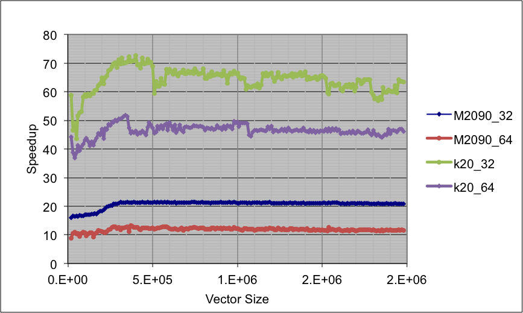

% Project Report
# Introduction
Land surface coverage data from satellite observation must be interpreted using physical models, which are computationally expansive. Using a surrogate Gaussian process (GP) emulator instead of complex physical models has been proved effective. The GP emulator is written in python, which is part of a python-based Earth Observation Land Data Assimilation System (EO-LDAS). However the current performance of the GP emulator is still far away from making it as a practical approach to process vast data from the satellites.

A _predict_ function will be called recursively, which is the most expansive function in the emulator. The objective of this project is to investigate the performance behaviour of it on different platform (i.e. CPUs and GPUs in this case), and to provide an appropriate parallel solution to improve the performance. In this project, we have also developed a prototype GPU CUDA/C++ implementation of the _predict_ function, which has achieved 65x speedup on K20 GPU comparing to the python CPU implementation.

# Python predict function
## Code explanation

The emulator calculates a hyper-parameters set first and uses these hyper-parameters to calculate the approximation of the input data, uncertainty and the associated gradient. Inside the emulator, the hyper-parameter calculation and the predict function are the most computational intensive part and meanwhile the most time-consuming. The difference between them is that the hyper-parameters are reusable. Once hyper-parameters have been calculated, it can be stored and be reused. It makes the impact of hyper-parameter calculation insignificant comparing to the _predict_ function. 

As a result, we will only focus on the _predict_ function in this project. The _predict_ function receives an input data of (Npredict x Nparam) and the inverted hyper-parameter covariance array (Ntrain x Ntrain). The input data of the _predict_ function is a 2-D array that consists of multiple parameter vectors, which can be biophysical parameters or state variables (e.g. leaf area index). The number of these parameters (Nparam) is around 10 while the length of these parameter vectors (Npredict), according to the proposal, will reach 1e8. 

## Performance analysis

The original python predict function is wrapped in GaussianProcess class, which has around 30 lines with six major functions/operations. The python predict function consists of scipy and numpy functions. Interestingly, the most computational intensive functions are not the most time consuming ones. For example, the matrix multiplication costs same amount of time per call as the element wise array multiplication where the previous has one magnitude higher the computational complexity than the later one. This inconsistency is caused by different level of optimisation of scipy. If we take a look at the numpy source code, its matrix multiplication function has a C extension with CBLAS. That’s the reason why numpy matrix operations are also comparable to the C++ implementation [Figure 1]. 
 
| Rank  | Operation                                         | Call  | Percentage of total wall time (%)     |
|:----: |-------------------------------------------------- |:----: |:---------------------------------:    |
|   1   | Array element wise multiplication (Matmul - Ele)  |  10   |               58.01                   |
|   2   | Matrix vector subtraction (MvSub)                 |  10   |               15.08                   |
|   3   | Array update: exp (Exp)                           |   3   |                9.71                   |
|   4   | Matrix multiplication                             |   1   |                8.47                   |
|   5   | Euclidean distance (Dist)                         |   1   |                5.54                   |
|   6   | Matrix vector multiplication (Mv)                 |  10   |                3.00                   |
|       | Total                                             |       |               99.81                   |

On this table, we can see two different types of operations, matrix operations (linear algebra operations), and array element wise operations. The element wise operations take 88% of total CPU wall time. On the contrary, due to a good optimisation under numpy and less number of calling, the matrix operations take only 12% of total wall time. 

## Comparison with C-BLAS implementation

C/C++ is regarded as one of the most efficient languages in general on CPU platforms. Before we go to the GPU, we would like to know how much potential does a CPU have. A very primitive C++ and BLAS implementation of the predict function has been carried out for this purpose. 

All major functions except distance calculation have a performance improvement. The performance of the element wise array multiplication has been largely improved. However what we didn’t expect is that the distance function of C++ is even slower than that in python. The distance function in python is a function in scipy library. Like numpy matrix multiplication, the distance function in scipy also has a C extension beneath. On the other hand, the memory access pattern of our primitive C++ implementation is very bad. That’s the reason why the distance in C++ is even slower than scipy distance function. We will just keep it in mind, and will not do any further optimisation on it since this implementation is just to give us an idea about how fast can CPU achieve. The scipy distance performance can more or less represent the level of C/C++ implementation. 

The result of the performance comparison shows the C++ predict function can be 1.3x faster than its python counterpart. If we ignore impact of the slowdown of distance function (in this case scipy can be regard as the highest performance on CPU), C++ implementation can achieve around 2.5x – 5x to original python implementation. The performance can vary from platforms, compilers and python versions. 

# GPU implementation of GP-Emulator
## CUDA/C++ implementation
CUDA with C/C++ extension is one of the most common and straightforward ways of heterogeneous programming on CUDA (NVidia) device. The CUDA APIs enable programs to control the CUDA device and memory explicitly.  

In spite that there is no standard python CUDA extension provided by NVidia, there are many third party APIs or wrappers that allow users to do heterogeneous programming in python, such as numbapro, theano, and pycuda.  They are usually easier to use, like theano, wrapped entirely the CUDA derivatives in python functions, leaving nothing for users to control the device explicitly. Some other APIs, such as Numbapro, which introduces not only wrapped functions, but also a CUDA dialect. In general, the third party APIs are easier to implement and easier to maintain but more difficult to control and their behaviour is more difficult to understand. 

Good software should find a balance between the software sustainability and the performance. However in this project we are more interested in investigating the behaviour of GPU and exploiting the all the resource on it. The prototype that has been built in this project is the most straightforward C++/CUDA implementation linking with python by C-Python API. With the performance of straightforward CUDA, we can set a performance reference of GPU for future development.

## Memory issues
In the emulator, Npredict can reach 108. In the case that we have to at least hold two Npredict x Ntrain (~250) matrix (93G) at the same time, the GPU memory (~5G) cannot cope with such a large demand. Fortunately, elements inside each parameter vector are independent to each other; in other word, we can truncate the large input vectors (Npredict) into multiple pieces and feed them slice by slice to the _predict_ function. This feature of the emulator solves the memory scarcity issue and moreover enables multiple GPUs implementation in the future. We will go through this in the later sessions. The size of input vector we feed every time to the GPU predict function is 2x105(~400M).
 
## Performance of GPU Kernels
| Rank  | Operation     | Call  | Percentage of total wall time (%)     |
|:----: |------------   |:----: |:---------------------------------:    |
|   1   | MvSub         |  10   |                21.1                   |
|   2   | Matmul-Ele    |  10   |                17.1                   |
|   3   | Dist          |   1   |                16.3                   |
|   4   | Mv            |  10   |                6.5                    |
|   5   | Matmul        |   2   |                3.8                    |
|   6   | Exp           |   1   |                0.1                    |
|       | Total         |       |               99.81                   |

To avoid GPU/CPU memory transferring overhead, the whole predict function instead of only major functions will be operated only on GPU. The GPU _predict_ is formed by multiple kernels, which correspond to its CPU counterparts. 

On the one hand we made array element wise operations kernels on GPU. GPU is very good at dealing with these problems due to its embarrassingly parallel feature. On the other hand, cuBLAS has been implemented for the matrix operation component of the _predict_. 

There are three major indicators to measure the GPU optimisation. The first is occupancy (active warp/ maximum warp) indicates if there are sufficient warp (32 threads) of GPU has been launched so that like memory latency can be covered; the rest two are the indicators of utilisation GPU resource including memory bandwidth (achieved bandwidth/device maximum bandwidth) and computation (flop achieved/maximum flops). 

Let us examine the two most expansive kernels here. These element wise operations are always memory bound, i.e. each floating-point operation needs two times memory access. The memory bandwidth of both kernels has been largely saturated, i.e. utilisation of memory bandwidth is 85%, while the computation is relatively low, 20% - 35%, due to the nature of element wise operations. It means the computation units of GPU are not fully exploited, due to the latency. The occupancy of both kernels are around 75% which is already very high, it means the GPU has almost tried its best to overlap the latency by launching more concurrent threads. At this point, the further optimisation can only lie upon the improvement to memory access pattern so that the access of memory can be more efficient. 

## Predict function performance 
GPU doesn’t create a very large overhead in the predict function. Memory copy between device and host takes only 0.1% of total run time. The entire GPU wall time is only 65.8% of total wall time, which means these once very expansive kernels are no longer the major performance bottleneck anymore, instead the python part of the predict (34.2%), (mainly truncating and distributing data to feed GPU) becomes the new bottleneck. To optimise this part will be the first priority of future optimisation. 

Conventionally, speedup is used as a metric to measure the performance gain of both serial and parallel optimisation. Strictly taken, one can only use it to compare the performance on the same platform. In heterogeneous programming, the speedup is just for giving an idea about the performance rather than a strict measurement, since the chose of different platform as a base can change entirely the final result. The speedup will be based on the performance of Intel Xeon 5500 CPU on Legion, which is the fastest CPU platform we get in this project. 

The tests have been carried out on 3 nvidia GPU cards, M2070 on Legion (tests are not ready due to the temporary outage of legion GPU), M2090 and K20 on Emerald. K20 is in Kepler architecture GPU, which is the latest architecture of NVidia GPU, while M2070/90 Fermi. The most distinctive difference between them is that K20 has more than 4 times thread processors than M series. _predict_ function on K20 shows 3 times faster than of M series. It takes K20 875 second to finish the _predict_ function with the vector size of 1e8. 

Since GPU is optimised on its single precision operations, the single precision _predict_ function is much faster than the double precision one. Both implementations have been applied in the source code. It is the user who to decide which precision to chose in light of the balance of the performance and the errors. 

GPU Predict performance  

## Software development details

The main objective of this project is to accelerate the GPU Gaussian Process predict function, which is a very small part of the code. There is no major change of the structure. The predict function C++/CUDA extension will be by cross platform compilation tool cmake which has also been integrated in the python setup. 

Unit tests have been introduced to the program for the purpose of verifying the correctness of GPU implementation especially by comparing the GPU results with original python results. Tests are carried out recursively with the changing the lengths input vectors under the CUnit testing framework. 

The code is compiled and tested every night on RSDT continuous integration system Jenkins.

# Summary and the future work

In this project, we have investigated the performance predict function in GP emulator. The most computational intensive operations, such as matrix multiplication and distance calculation are not necessary to be the most time consuming operation, due to its optimisation by scipy and numpy library. The major bottleneck of _predict_ function is the array element wise operations. A GPU implementation prototype has also been made, by porting element wise operations as kernels on GPU and using cuBLAS library to deal with matrix operations. It achieves 65x speedup when running on K20 GPU with single precision. 

The further single GPU optimisation of the predict function should focus on data distribution part in python. Kernels on GPU still have some space to improve, if the memory access pattern can be improved. It will also be interesting to checkout the performance of some third party APIs such as Numbapro. Third party APIs can reduce largely the code complexity. In the future, developers can balance code sustainability and performance with the performance reference of the CUDA implementation. 

With the base of single GPU, it seems to be very promising to have multiple GPUs implementation. First, a single GPU has already achieved a quite good performance. Second, the predict function is embarrassingly paralleled which means all inputs can be divided and distributed arbitrarily, as what we did in the single GPU case. Third, communications among GPU nodes will be relatively small, which occurs only at the beginning and in the end. Multiple GPUs implementation can fundamentally change the performance to meet the final scientific target. 
